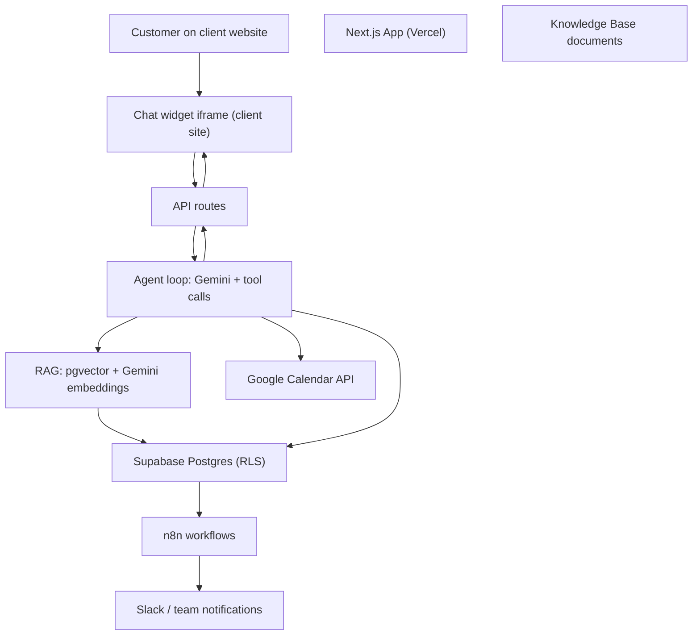

# RelayOS

> The Autonomous AI Front Office for Service Businesses.

RelayOS turns a service business's website into a self-serve front office. An
embeddable AI chat widget answers customer questions from the business's own
knowledge base, captures lead information, checks live calendar availability,
and books real appointments on Google Calendar — while scoring and prioritizing
leads, generating handoff summaries for the team, and firing automation events
into n8n. Everything is managed from a modern dashboard with revenue-recovery
analytics and agency-style multi-tenancy.


---

## Table of contents

- [Why RelayOS](#why-relayos)
- [Key features](#key-features)
- [Architecture](#architecture)
- [Tech stack](#tech-stack)
- [Getting started](#getting-started)
- [Google Calendar booking](#google-calendar-booking)
- [n8n automations](#n8n-automations)
- [Embedding the widget](#embedding-the-widget)
- [API reference](#api-reference)
- [Project structure](#project-structure)
- [Testing](#testing)
- [Deployment](#deployment)
- [Environment variables](#environment-variables)
- [Security](#security)
- [Roadmap](#roadmap)
- [License](#license)

---

## Why RelayOS

Service businesses (HVAC, plumbing, dental, salons, and so on) lose revenue
every minute a lead has to wait. Their websites usually offer nothing more than
a phone number and a contact form, so after-hours visitors either bounce or
book with a competitor.

RelayOS is a drop-in front office that works 24/7:

- Answers questions accurately using the business's own documents, not a
  generic model.
- Captures contact details and lead intent during the conversation.
- Checks the owner's real Google Calendar and books appointments directly from
  chat.
- Prioritizes urgent leads and hands them to a human with an AI-written summary.
- Reports the actual revenue those conversations recovered.

Because it runs entirely on free tiers (Vercel, Supabase, Gemini, Google
Calendar, self-hosted n8n), a single operator or agency can serve multiple
client businesses at near-zero marginal cost.

## Key features

**Embeddable AI chat widget**

- A small, brandable iframe that drops onto any client website via a one-line
  script tag.
- No API keys or accounts required from the end customer.

**Knowledge-base-grounded answers (RAG)**

- Documents are chunked, embedded, and stored in a `pgvector` index.
- Each user message is grounded in a semantic search over the business's own
  content before the model answers.

**Tool-calling agent**

- Captures lead contact info and service intent.
- Checks Google Calendar availability.
- Creates real Google Calendar events for confirmed bookings.
- Escalates to a human with a generated conversation summary.

**Lead scoring and intelligence**

- Every message updates a deterministic score based on contact info captured,
  urgency language, and engagement depth.
- Urgent signals ("my AC is broken, I need someone today") are detected even
  when worded in natural, varied ways.

**Automation engine**

- Events (booking created, lead qualified, lead escalated) are persisted and
  delivered to n8n webhooks.
- Delivery is tracked; failures never break the customer-facing flow.
- Starter n8n workflows are included in `automations/` (Slack notifications
  included).

**Revenue-recovery analytics**

- Live conversion funnel, average response time, and "revenue recovered"
  computed from real bookings and configured average job value.

**Agency mode**

- One login, many client businesses.
- Each business has its own widget key, knowledge base, calendar connection,
  and analytics, fully isolated by Row Level Security.
- One-click business switcher in the sidebar.

## Architecture



The main request path is `POST /api/widget/message`. It authenticates the widget
key, rate-limits the visitor, resolves the business, retrieves relevant
knowledge-base chunks, runs the Gemini agent loop with tool declarations, and
persists the conversation — while emitting automation events to n8n.

## Tech stack

| Layer | Technology |
| --- | --- |
| Framework | Next.js 14 (App Router, RSC, Server Actions) |
| Language | TypeScript (strict) |
| Styling | Tailwind CSS + a custom design system |
| Charts | Recharts |
| Database | Supabase (PostgreSQL, pgvector, Row Level Security) |
| Auth | Supabase Auth (email/password, cookie sessions) |
| AI | Gemini API (chat + embeddings), RAG pipeline |
| Calendar | Google Calendar API (OAuth 2.0) |
| Automation | Self-hosted n8n Community Edition (Docker) |
| Testing | Vitest (unit) + GitHub Actions CI |
| Deployment | Vercel (App), Supabase (DB), Docker/n8n (automation) |

## Getting started

### Prerequisites

- Node.js 20+ and npm
- A free [Supabase](https://supabase.com) project
- A free [Gemini API key](https://aistudio.google.com/apikey) (no credit card)
- A Google Cloud project with the Calendar API enabled (only if you want booking)
- Docker (only if you want local n8n automation)

### 1. Create the database

1. Create a Supabase project (free tier).
2. Open the **SQL Editor** and run the migrations in `supabase/migrations/`
   **in order** (`0001_init.sql`, `0002_bookings.sql`,
   `0003_lead_scoring.sql`, ...). They create the schema, enable `pgvector`,
   configure Row Level Security, and seed a demo business
   ("Aurora HVAC & Air").
3. In **Authentication → Providers → Email**, disable **Confirm email** for
   local testing so signup logs you in immediately. Re-enable it before
   production.
4. From **Project Settings → API**, copy the **Project URL**, **anon public
   key**, and **service_role key**.

### 2. Install dependencies

```bash
npm install
```

### 3. Configure environment variables

```bash
cp .env.example .env.local
```

Fill in every value from the previous steps. See
[Environment variables](#environment-variables) for the full reference.

### 4. Run the development server

```bash
npm run dev
```

Open [http://localhost:3000](http://localhost:3000).

### 5. Verify the flow end-to-end

1. Go to `/signup` and create an account. This provisions an organization and
   your first business.
2. In **Settings**, connect Google Calendar and paste your n8n webhook URL (if
   set up).
3. In **Knowledge Base**, add a document — re-saving the seeded "Services &
   Pricing" content triggers the embedding ingestion automatically.
4. Open `/widget/<your-widget-key>` (also linked from Settings) and chat with
   the AI.
5. Ask something covered by the knowledge base, then request a booking for a
   specific day and time. The agent checks availability and creates a real
   Google Calendar event — visible in **Bookings**.
6. In **Leads**, watch the score update after every message. Try something
   urgent and see the score jump.
7. Ask to talk to a real person — the agent escalates and (if configured)
   notifies the team via n8n/Slack.
8. In **Analytics**, confirm the funnel, response time, and revenue recovered
   reflect what you just did.
9. Use **Settings → Agency mode → Add another business** to create a second
   client, then switch businesses from the sidebar.

## Google Calendar booking

1. In the [Google Cloud Console](https://console.cloud.google.com), create a
   project and enable the **Google Calendar API**.
2. Configure the **OAuth consent screen** (External works for testing — add
   yourself as a test user).
3. Create an **OAuth client ID** of type "Web application" and add
   `http://localhost:3000/api/integrations/google-calendar/callback` as an
   authorized redirect URI.
4. Set `GOOGLE_CLIENT_ID`, `GOOGLE_CLIENT_SECRET`, and `GOOGLE_REDIRECT_URI` in
   your environment.
5. In the dashboard, open **Settings** and click **Connect** under Google
   Calendar to authorize the account the widget books on.

## n8n automations

The included `automations/*.json` files are ready-to-import n8n workflows:
booking confirmed, lead qualified, and lead escalated (with Slack
notifications).

1. Start n8n:

```bash
docker compose up -d
```

2. Open `http://localhost:5678` and create your n8n owner account.
3. In **Workflows**, import each file from `automations/`.
4. Activate each workflow and copy its **Webhook Production URL**.
5. Paste the URLs into **Settings → Automations** for each business.

For an always-on setup, run the same `docker-compose.yml` on a free-tier VM
(e.g. an Oracle Cloud "Always Free" ARM instance) to avoid n8n Cloud's paid
execution limits.

## Embedding the widget

From **Settings**, copy either:

- The **embed snippet** (`public/embed.js` + widget iframe) to paste into any
  website, or
- The direct widget URL: `https://<your-app>/widget/<widget-key>`.

The widget is a standalone iframe and requires no client-side API keys.

## API reference

| Method | Endpoint | Description |
| --- | --- | --- |
| POST | `/api/widget/message` | Public AI chat endpoint (RAG + agent loop) |
| POST | `/api/auth/logout` | End the session |
| GET | `/api/auth/callback` | Supabase auth callback |
| GET | `/api/integrations/google-calendar/connect` | Start Google OAuth flow |
| GET | `/api/integrations/google-calendar/callback` | Complete Google OAuth flow |
| GET | `/api/v1/businesses` | List businesses (agency mode) |
| POST | `/api/v1/businesses` | Create a business |
| PATCH | `/api/v1/businesses/[businessId]` | Update a business |
| GET | `/api/v1/businesses/switch` | Switch current business |
| POST | `/api/v1/knowledge-base/documents` | Ingest a knowledge-base document |
| POST | `/api/v1/organizations/provision` | Provision org + first business |
| POST | `/api/v1/automations/webhook` | n8n-facing automation webhook (HMAC-signed) |

## Project structure

```
app/
  (auth)/                   login, signup
  (dashboard)/              overview, inbox, leads, bookings, knowledge-base, analytics, settings
  api/
    widget/message          public AI chat endpoint (RAG + tool-calling agent)
    v1/                     authenticated dashboard endpoints (incl. multi-business switch/create)
    integrations/           Google Calendar OAuth connect/callback
  widget/[widgetKey]        the iframe page the embed snippet loads on client sites
components/
  ui/                       design-system primitives (button, card, input, tooltip, avatar, ...)
  dashboard/                sidebar, forms, charts, KPI cards, settings sections
  widget/                   chat widget + embeddable iframe frame
  auth/                     auth page shell
  landing/                  public marketing page
lib/
  ai/                       Gemini client, system prompt, tool declarations, agent loop, summarizer
  rag/                      chunking, embedding/ingestion, semantic retrieval
  supabase/                 browser / server / service-role clients
  scoring.ts                deterministic lead scoring
  analytics.ts              revenue/response-time/funnel calculations
  conversations.ts          conversation + message persistence
  google-calendar.ts        OAuth, availability checks, event creation
  automation-events.ts      records + delivers events to n8n
  current-business.ts       agency-mode business resolution + switcher data
  webhook-signing.ts        HMAC signing/verification for n8n webhooks
  rate-limit.ts             in-memory or Upstash-backed rate limiting
  crypto.ts                 AES-256-GCM encryption for OAuth tokens at rest
  format.ts                 shared display formatting
  *.test.ts                 unit tests live next to the code they test
automations/                importable n8n workflow templates
supabase/migrations/        schema as versioned SQL
public/embed.js             the vanilla-JS snippet businesses paste on their site
scripts/                    maintenance scripts (e.g. calendar token backfill)
middleware.ts               session refresh + dashboard route protection
```

## Testing

```bash
npm run typecheck    # TypeScript, no emit
npm run test         # unit tests (vitest)
npm run test:watch   # unit tests, watch mode
npm run test:coverage
```

The suite targets the parts of the app where a silent bug would cost a client
money or trust:

- Lead scoring (`lib/scoring.test.ts`)
- RAG chunking and ingestion (`lib/rag/ingest.test.ts`)
- The agent tool-execution layer (`lib/ai/tools.test.ts`) — the single place
  the AI's decisions become real database writes and calendar events
- System prompt building (`lib/ai/prompts.test.ts`)
- Revenue / response-time / funnel math (`lib/analytics.test.ts`)
- Automation event delivery (`lib/automation-events.test.ts`)
- Webhook signature verification (`lib/webhook-signing.test.ts`)
- Crypto, rate limiting, Google Calendar integration, and business resolution

External services (Supabase, Google Calendar, Gemini) are mocked at the module
boundary, so the tests run instantly with no live credentials.

## Deployment

**App**

Push this repository to GitHub and import it on
[Vercel](https://vercel.com) (Hobby/free plan). Add the same environment
variables, set `NEXT_PUBLIC_APP_URL` to your Vercel URL, and add that URL as an
authorized redirect URI on your Google OAuth client.

**Database**

Already on Supabase's free tier. Note that free projects pause after ~7 days of
inactivity — ping any endpoint periodically to keep a live demo warm.

**Automation**

Self-host n8n Community Edition (the included `docker-compose.yml`) on a
free-tier VM to avoid n8n Cloud's paid execution limits.

### CI/CD

`.github/workflows/ci.yml` runs typecheck, unit tests, and a full production
build on every push and pull request to `main`, using placeholder env vars so
the build can statically analyze pages — no real secrets ever touch CI.

## Environment variables

| Variable | Required | Description |
| --- | --- | --- |
| `NEXT_PUBLIC_SUPABASE_URL` | Yes | Supabase project URL |
| `NEXT_PUBLIC_SUPABASE_PUBLISHABLE_KEY` | Yes | Supabase anon/publishable key |
| `SUPABASE_SECRET_KEY` | Yes | Supabase service_role key (server-only) |
| `GEMINI_API_KEY` | Yes | Gemini API key |
| `ENCRYPTION_KEY` | No* | 64-char hex key for AES-256-GCM token encryption |
| `GEMINI_CHAT_MODEL` | No | Chat model (default `gemini-3.5-flash-lite`) |
| `GEMINI_EMBEDDING_MODEL` | No | Embedding model (default `gemini-embedding-001`) |
| `GOOGLE_CLIENT_ID` | No* | Google OAuth client ID (for bookings) |
| `GOOGLE_CLIENT_SECRET` | No* | Google OAuth client secret |
| `GOOGLE_REDIRECT_URI` | No* | Google OAuth redirect URI |
| `NEXT_PUBLIC_APP_URL` | No | App URL used for embed snippets |
| `RATE_LIMITER_BACKEND` | No | `memory` or `upstash-redis` (default `memory`) |
| `UPSTASH_REDIS_REST_URL` | No | Upstash Redis REST URL |
| `UPSTASH_REDIS_REST_TOKEN` | No | Upstash Redis REST token |
| `RATE_LIMIT_WINDOW_MS` | No | Rate-limit window (default `60000`) |
| `RATE_LIMIT_MAX_REQUESTS` | No | Max requests per window (default `12`) |

\* Required only if you use the corresponding feature (token encryption /
calendar booking).

## Security

- **Row Level Security** isolates every business and tenant; all data access
  goes through RLS policies.
- **Server-side secrets only** — `SUPABASE_SECRET_KEY` and
  `GOOGLE_CLIENT_SECRET` are never shipped to the client bundle.
- **OAuth tokens at rest** are encrypted with AES-256-GCM using
  `ENCRYPTION_KEY` (run `openssl rand -hex 32` to generate one).
- **Rate limiting** protects public endpoints from abusive traffic and from
  draining your free-tier AI quota; an Upstash Redis backend is supported for
  multi-instance deployments.
- **HMAC-signed webhooks** let n8n verify that automation events really come
  from your app.
- **Input validation** on every public endpoint (length limits, required
  fields, safe error messages).

## Roadmap

- White-label theming per client (custom domains, logo upload) beyond the
  current brand color.
- Background job queue for automation retries instead of best-effort inline
  delivery.
- More calendar providers (Cal.com, Microsoft 365).
- Multi-language widget responses.

## License

Released under the [MIT License](./LICENSE).
